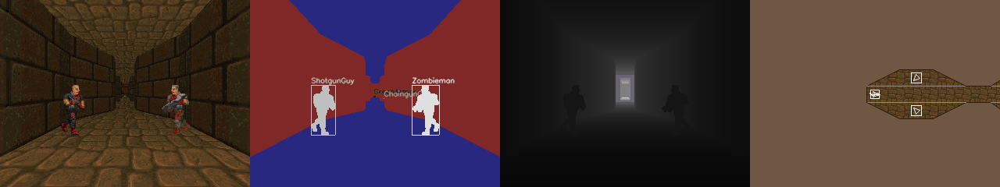

# AI-Doom-Smart-Player
Using Convolution Q-Learning to allow me to pass a level of Doom

## Getting Started
1. Clone this repo
2. Download .ova in Resources Below
3. Place .ova in root directory
4. Run 'ai.py'
5. Enjoy playthroughs in video file that can be highlighted by the example below

## Resources
[PyTourch Documenation](https://pytorch.org/docs/master/)

[OpenAI Gym](https://gym.openai.com/envs/DoomCorridor-v0)
